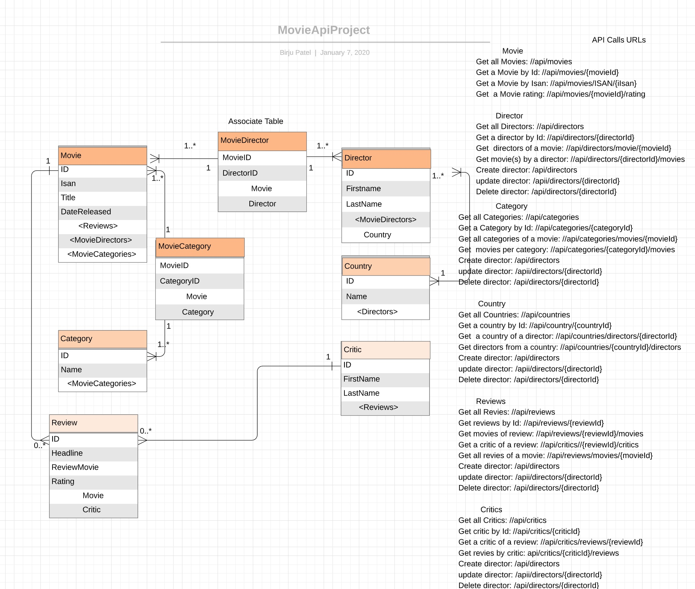

# MovieApi Project

`MovieApi` is a Sample Web API Project developed by [Birju Nakrani](https://github.com/birjunakrani) using **.Net Core 2.2**, **SQL server** as Database and **EntityFramework**. 

## Usage
It exhibits CRUD operation performed through Web API.

You can use any API testing tool like [_**postman**_](https://www.getpostman.com/) to test these API operations.

## ER Diagram & API Call Instructions


Please visit [_**lucidchart**_](https://www.lucidchart.com/documents/view/5f949dd9-35c3-4d6c-80af-716b05ba4bdd/0_0) to see ER diagram showing entity relationships in detail. 

Here, You can also find various methods to perform CRUD operation and URI's to use to test these operations.
Used Code first approach to map entity classes to DB tables using EntityFramework.
I have used an instance of SQL server database. You can find the connection strgin in launchsettings.json
Also, I have seeded initial data through Database seeding method for ease of testing. 
While Creating/Adding data to some of the entities, need to be mindful of relationship.
e.g. if you want to test POST method to add Director, it also requires Country object to be associated with
so, if you are trying localhost:xxx/api/directors  in the body of POST method,
```
    {
        "firstName": "Paul",
        "lastName": "Anderson",
        "Country":{
                    "Id":xx,
                    "Name": "xxxx"
    }
```

Same way, if you want to POST new review, it requires Critic to be associated with due to parent-child relationship
```
    {
        "headline": "xxxxxxxxx",    // please see the model class to see validation on these properties
        "reviewMovie": "xxxxxxxxxxxxxxxxxxxxxxxxxx.",   // please see the model class to see validation on these properties
        "rating": 4,
        "Critic" : 
        {
            "Id":xx,
            "FirstName": "xxx",
            "LastName":"xxxx"
        }
    }
```

Some entity classes don't accept duplicate records like Country, Category.
ALso, API is mindful of referential integrity, 
You can only delete Country,Category if there are no Directors, Movie associated to that country,category.
if you delete Critic, Reviews related to that CriticID will also be deleted. 

--Birju Nakrani
